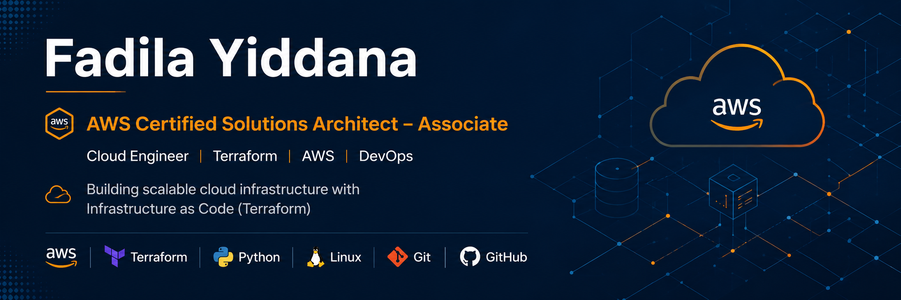
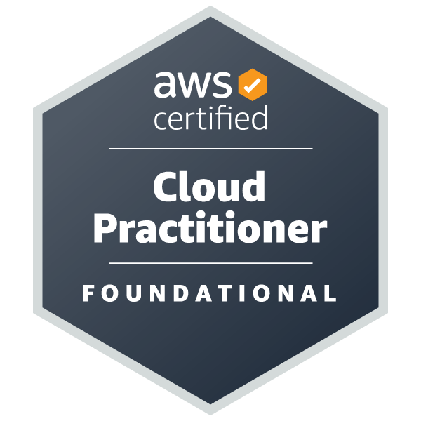
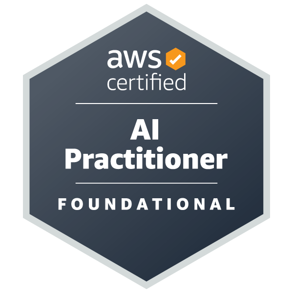
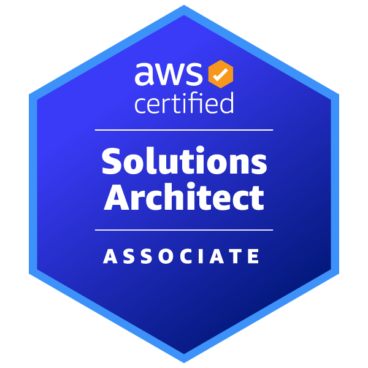
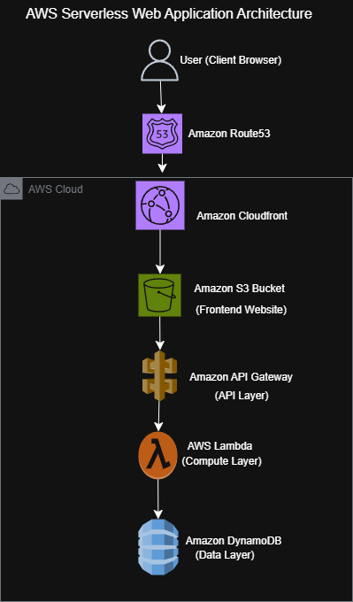
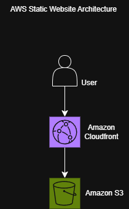

  

# Hi, I'm Fadila Yiddana 

### AWS Certified Solutions Architect – Associate | Cloud Engineer | Terraform Enthusiast

I'm passionate about designing secure, scalable, and highly available cloud infrastructure on Amazon Web Services (AWS).

I completed cloud engineering training through **AmaliTech Ghana**, where I gained hands-on experience designing, deploying, and managing cloud solutions using the **AWS Management Console**, **AWS CLI**, **AWS SDKs**, and **Terraform** through practical labs and project-based learning.

Today, I continue building public cloud projects to strengthen my skills in **Infrastructure as Code (IaC)**, cloud architecture, automation, and DevOps while preparing for opportunities as a Cloud Engineer.

##  GitHub Statistics

  
  

##  GitHub Achievements

##  GitHub Contribution Streak

  

##  Contribution Graph

  

---

#    AWS Certifications

  
  &nbsp;&nbsp;
  
  &nbsp;&nbsp;
  

  <strong>AWS Certified Cloud Practitioner</strong> 
  <strong>AWS Certified AI Practitioner</strong> 
  <strong>AWS Certified Solutions Architect – Associate</strong>

---

##  Technical Toolkit

---

#  AWS Services

### Compute

* Amazon EC2
* AWS Lambda
* Auto Scaling

### Storage

* Amazon S3
* AWS Backup

### Networking

* Amazon VPC
* Amazon Route 53
* Amazon CloudFront
* Amazon API Gateway
* Application Load Balancer (ALB)

### Database

* Amazon DynamoDB
* Amazon RDS

### Security

* IAM
* Security Groups

### Monitoring

* Amazon CloudWatch

---

#  Hands-On Experience

During my training at **AmaliTech Ghana**, I gained practical experience building and managing AWS solutions using:

* AWS Management Console
* AWS CLI
* AWS SDKs
* Terraform

Hands-on activities included:

* Designing highly available AWS architectures
* Building serverless applications
* Deploying static websites on AWS
* Implementing Infrastructure as Code (Terraform)
* Configuring Amazon VPC networking
* Managing IAM users, roles, and policies
* Implementing storage, backup, and disaster recovery solutions
* Monitoring infrastructure using Amazon CloudWatch

I continue expanding these skills by building and documenting cloud projects in public GitHub repositories.

---

##  Featured Projects

### Terraform AWS Highly Available Three-Tier Architecture

  

Enterprise-grade AWS infrastructure demonstrating a highly available three-tier architecture using Terraform. The solution includes Amazon VPC, Multi-AZ networking, Application Load Balancer, Auto Scaling, Amazon RDS, Route 53, and CloudFront following AWS Well-Architected best practices.

---

### Terraform AWS Serverless Web Application

  

A fully serverless web application provisioned with Terraform using Amazon S3, CloudFront, API Gateway, AWS Lambda, and Amazon DynamoDB. This project demonstrates Infrastructure as Code, cloud-native architecture, and scalable backend design.

---

### Terraform AWS Visitor Counter

  

A serverless visitor counter application built with Terraform. Website requests flow through Amazon API Gateway and AWS Lambda, while visitor counts are stored in Amazon DynamoDB and delivered globally using Amazon CloudFront.

---

### Terraform AWS Static Website

  

A beginner-friendly Infrastructure as Code project demonstrating how Terraform provisions an AWS static website using Amazon S3 and CloudFront while following cloud architecture best practices.

##  Currently Learning

* Advanced Terraform Modules
* CI/CD with GitHub Actions
* Docker Containers
* Kubernetes Fundamentals
* AWS DevOps Services
* Infrastructure Automation
* Monitoring & Observability

---

#  Career Objective

I'm currently seeking opportunities as a:

* Cloud Engineer
* Junior Cloud Architect
* DevOps Engineer

where I can contribute to designing and automating secure, scalable cloud infrastructure while continuing to grow professionally.

---

##  Let's Connect

Always open to opportunities in Cloud Engineering, Cloud Architecture, and DevOps.

---

 *Thanks for visiting my GitHub profile! Feel free to explore my repositories and follow my cloud engineering journey.*
